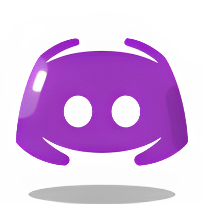
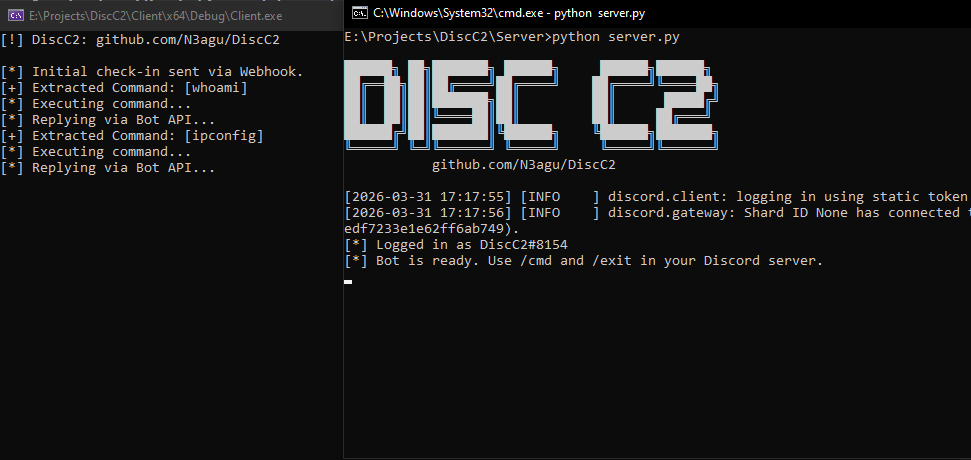
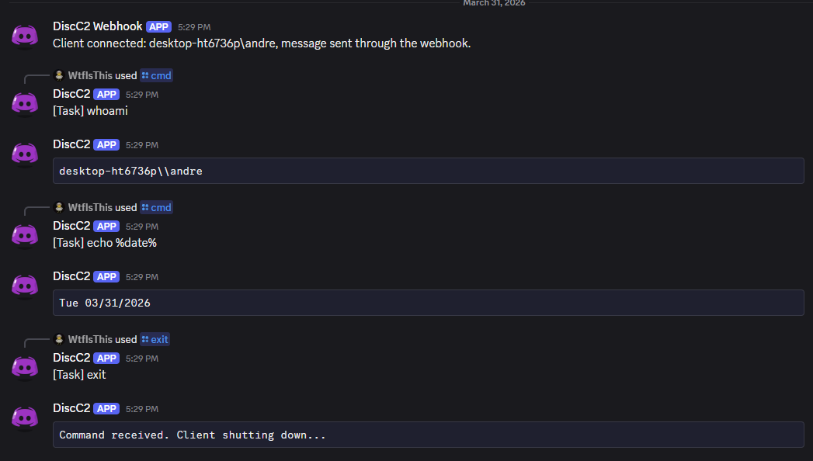

<div align="center">
  <h1>DiscC2</h1>
  
  
  <p><b>An educational Proof of Concept demonstrating how to use the Discord API as a C2 Server.</b></p>
</div>

## Overview
**DiscC2** is a lightweight C2 PoC with no dependencies. It demonstrates "Living off the Cloud" techniques by utilizing Discord channels and Webhooks as a dead-drop resolver to route commands and exfiltrate outputs. By leveraging trusted domains (`discord.com`), this project illustrates how modern evasion techniques bypass traditional network perimeter defenses.

<div align="center">
  
</div>

## Key Features

* **Discord API Integration**
    * Leverages the Discord REST API (Bots and Webhooks) to act as a resilient, trusted-domain proxy for task dispatching and data exfiltration, blending C2 traffic with normal user/bot HTTPS traffic.
    * **Note:** While using a trusted domain provides initial stealth, this method has significant weaknesses. The constant polling interval (beaconing) is easily detectable by modern EDR/NDR solutions. Furthermore, Discord's internal abuse-monitoring systems can identify and flag anomalous API activity, leading to account suspension.
    * **Risk:** Since the Discord Bot Token and Webhook URL are required by the client to poll for tasks and exfiltrate data, a successful reverse-engineering of the client binary would grant them full control over the C2 infrastructure. This could allow defenders to "take over" the bot, spam the webhook, or intercept communications.

* **No External C++ Dependencies**
    * The client relies entirely on standard C++ libraries (STL) and the OS's native `curl` and `_popen` functions.
    * *Note: While the STL is typically avoided in real-world malware development to minimize binary size and runtime dependencies, it is utilized in this PoC to keep the source code as accessible as possible.*

* **Showcases Both Implementations (Webhooks and Bot)**
    * Demonstrates the two primary methods of Discord-based communication within a single agent. It utilizes a Webhook (if configured) exclusively for the initial client check-in to identify the infected user environment. 
    * Following the initial check-in, all continuous command polling and output replies are routed directly through the Bot API. This split approach effectively showcases the distinct capabilities and use-cases of both Discord integration methods.

## How It Works
1. The Server (Python) registers Discord Slash Commands (`/cmd`, `/exit`).
2. The Operator types a command in the designated Discord server, which the Python bot intercepts and formats into a `[Task]` message.
3. The Client (C++) performs an initial check-in via the Webhook (if provided) and then continuously polls the designated Discord channel's history for new tasks.
4. Upon finding a new task ID, the client parses the command and executes it locally.
5. The client captures the terminal output and replies directly in the command channel via the Bot API.

## Screenshots

<details open>
  <summary><strong>Screenshot of Tasks</strong></summary>
  
  
</details>

## Setup & Configuration

### 1. Prerequisites
* A Discord account and a private Discord server.
* A Discord Developer Application (Bot) with a generated Bot Token.
* (Optional) A Discord Webhook URL for data exfiltration.
* A copy of this repository.

```sh
git clone https://github.com/N3agu/DiscC2.git
```

### 2. Server Setup (Python)
The server requires the `requests` and `discord.py` libraries.

```sh
pip install requests discord.py
python3 server.py
```

*On first run, the server will prompt you for your Discord Bot Token, Target Channel ID, and an optional Webhook URL. It will save these to a settings.json file automatically.*

You can make the configuration file manually by creating the file "settings.json" in the Server directory with the following structure:
```json
{
    "bot_token": "YOUR_DISCORD_BOT_TOKEN",
    "channel_id": "YOUR_CHANNEL_ID",
    "webhook_url": "YOUR_WEBHOOK_URL_OR_BLANK"
}
```

### 3. Client Setup (C++)
Create the file 'settings.h' in the Client directory with the following structure and ensure they match the settings used on the Server:
```cpp
#pragma once
#include <string>

const std::string BOT_TOKEN = "YOUR_DISCORD_BOT_TOKEN"; 
const std::string CHANNEL_ID = "YOUR_CHANNEL_ID";
const std::string WEBHOOK_URL = "YOUR_WEBHOOK_URL_OR_BLANK";
```

*! Compilation was done using VS2022.*

## Disclaimer

***This project is an educational Proof of Concept designed to demonstrate how legitimate platforms can be utilized by threat actors. It is intended strictly for academic research, defensive analysis, and portfolio demonstration.***

***Using this code to violate Discord's Terms of Service, or deploying it on systems without explicit, mutual, and documented permission, is strictly prohibited. The author assumes no liability and is not responsible for any misuse or damage caused by this program.***
